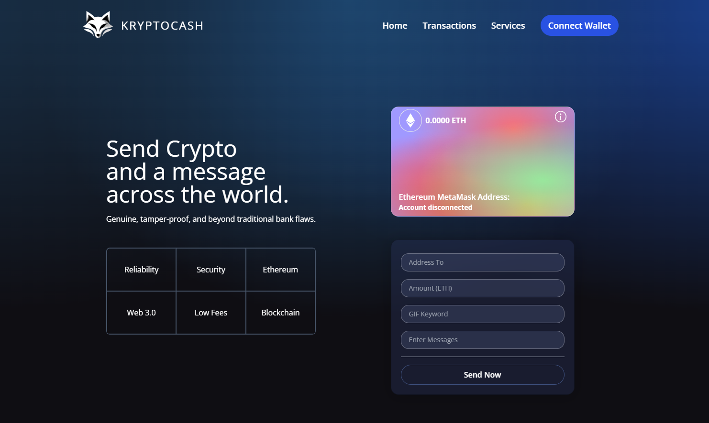

# Kryptocash

Welcome to my first full-stack dApp, a project that represents my initial dive into the world of Solidity and its integration with React. This application is a humble yet significant step into my Web 3 journey! It enables users to connect to their MetaMask wallet, send funds accompanied by personalized messages and GIFs, and monitor all transactions made through the app. The smart contract has been deployed on the Ethereum Testnet to avoid gas fees, but it's fully functional and compatible with the Mainnet as well!
 
Link: https://kryptocash.vercel.app/

Smart Contract: https://sepolia.etherscan.io/address/0x90c8e8cF5aaD3Aaf18DeAF46E0381E50F5E09ed0



## 💡Features

- Metamask Integration: Connects to the Metamask extension in Google Chrome.
- Dynamic Account Detection: Automatically connects when you switch your previously connected Metamask wallet.
- Send ETH with a Personalized Message: Enter the recipient's address, ETH amount, a custom message, and a GIF keyword.
- Transaction History: Track all your transactions within the app, complete with links to Etherscan for more detailed insights.
- Simple and clean UI crafted using Tailwind.
 

## 💻 Technologies Used

- React
- Tailwind
- Solidity
- Hardhat
- MetaMask

## 🚀 Getting Started

These instructions will help you set up the project locally, for development and testing.

### Prerequisites

- Node.js v18 above.
- npm

### Installation & Setup

1. Clone the repository:

```
git clone https://github.com/romnegrillo/nike-rom
```

2. Navigate to the project directory. Note that this project contains both the client and the smart contract, you need to start the client only since the smart contract has already been deployed.

```
cd kryptocash
cd client
```

3. Install dependencies:

```
npm install
```

4. Run the development server:

```
npm run dev
```
